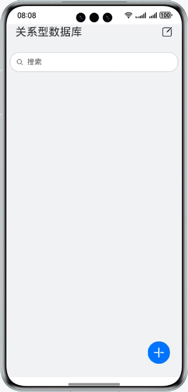

# 关系型数据库（ArkTS）

### 简介

本Codelab以记账为例，使用关系型数据库的相关接口实现了对账单的增、删、改、查操作。效果图如下：

ohpm install @mcui/mccharts

### 相关概念

- 关系型数据库：基于关系模型来管理数据的数据库，提供了增、删、改、查等接口，也可运行输入的SQL语句满足复杂场景需要。

### 相关权限

不涉及

### 使用说明

1. 在应用首页，点击右下角“添加”图标，在弹出的窗口中选择账目类型并填写金额，点击“确定”按钮添加一条账目。
2. 在应用首页，点击右上角“编辑”图标，选中想要删除的账目，点击下方“删除”图标，删除选择的账目。
3. 在应用首页，点击想要编辑的账目，在弹出的窗口中更改账目类型或金额，点击“确定”按钮修改一条账目。
4. 在应用首页，点击搜索栏，填写想要查找的账目金额，点击“搜索”图标后下方刷新为金额为查找金额的账目，搜索栏为空时显示全部账目。

### 约束与限制

1. 本示例仅支持标准系统上运行，支持设备：华为手机。
2. HarmonyOS系统：HarmonyOS NEXT Developer Beta1及以上。
3. DevEco Studio版本：DevEco Studio NEXT Developer Beta1及以上。
4. HarmonyOS SDK版本：HarmonyOS NEXT Developer Beta1 SDK及以上。
