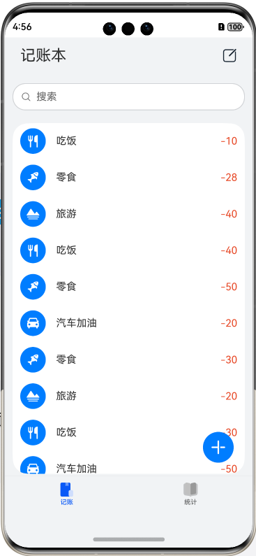
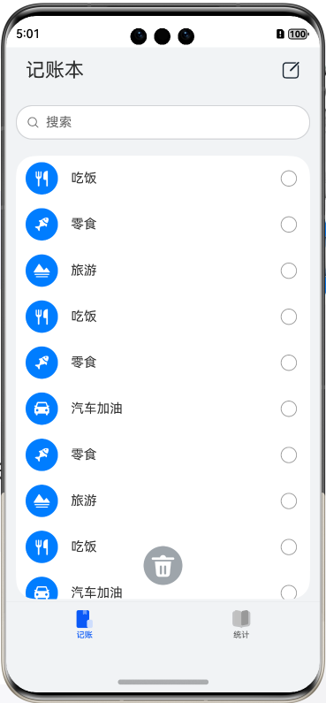
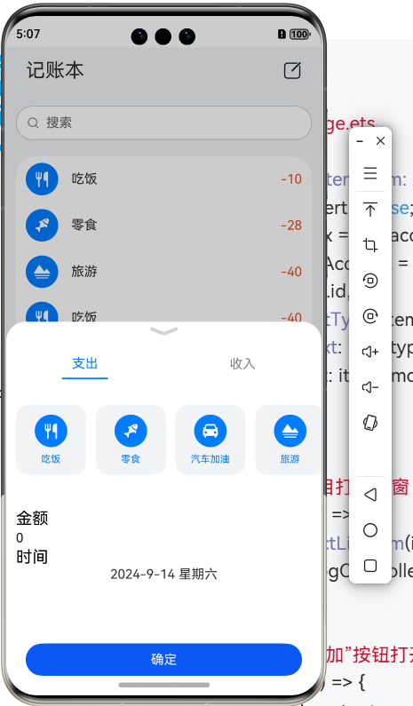
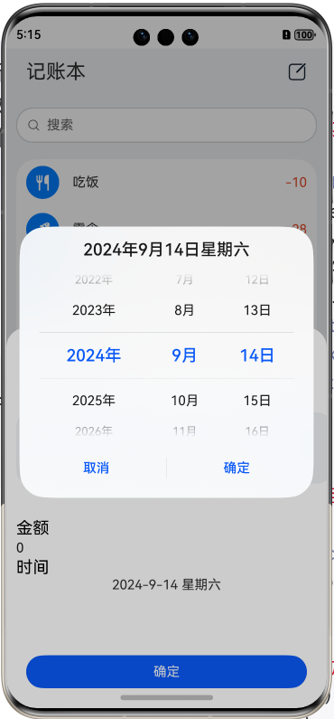
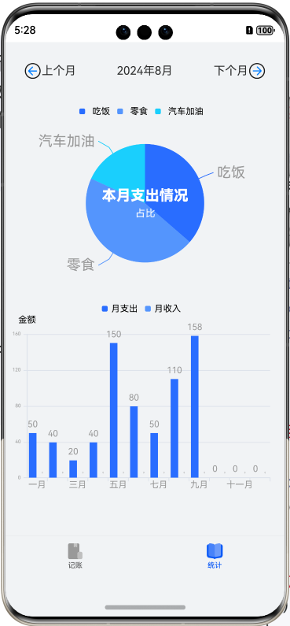
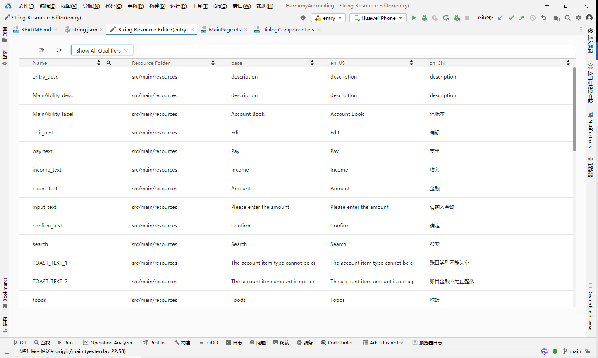
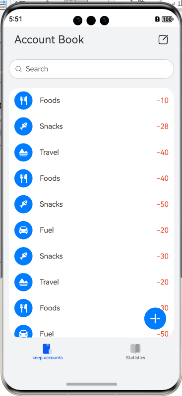
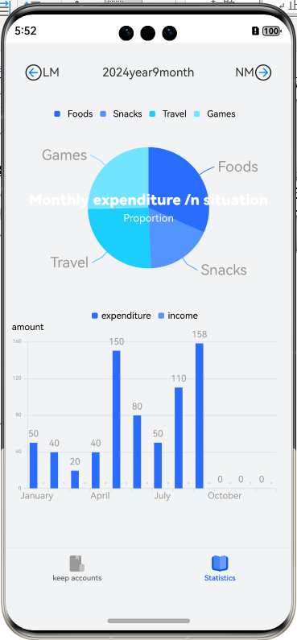

# 记账本（ArkTS）

### 一、 简介

本项目示例展示了如何使用关系型数据库（ArkTS）实现账目管理功能，包含了分析统计功能。：

#### 记账页面


#### 统计页面


### 二、 环境搭建
#### 软件要求
- DevEco Studio版本：DevEco Studio NEXT Developer Beta1及以上。
- HarmonyOS SDK版本：HarmonyOS NEXT Developer Beta1 SDK及以上。

#### 硬件要求
- 设备类型：华为手机。
- HarmonyOS系统：HarmonyOS NEXT Developer Beta1及以上。

#### 开发环境搭建
1. 安装DevEco Studio，详情请参考[下载](https://developer.huawei.com/consumer/cn/doc/harmonyos-guides-V5/ide-software-download-V5)和[安装软件](https://developer.huawei.com/consumer/cn/doc/harmonyos-guides-V5/ide-software-install-V5)。
2. 设置DevEco Studio开发环境，DevEco Studio开发环境需要依赖于网络环境，需要连接上网络才能确保工具的正常使用，详情请参考配置[开发环境](https://developer.huawei.com/consumer/cn/doc/harmonyos-guides-V5/ide-environment-config-V5)。
3. 开发者可以参考以下链接，完成设备调试的相关配置：
   - [使用真机进行调试](https://developer.huawei.com/consumer/cn/doc/harmonyos-guides-V5/ide-debug-device-V5)
   - [使用模拟器进行调试](https://developer.huawei.com/consumer/cn/doc/HiCar-Guides/get-device-0000001135423484)
4. 第三方库的安装：进入项目目录，打开命令行，输入以下命令：

    `ohpm install @mcui/mccharts`

### 三、 代码结构

``` plaintext
├──entry/src/main/ets               // 代码区
│ ├──common
│ │ ├──constants
│ │ │  └──CommonConstants.ets     // 公共常量
│ │ ├──database
│ │ │ ├──tables
│ │ │ │  └──AccountTable.ets     // 账目数据表
│ │ │  └──Rdb.ets                 // RDB数据库
│ │ └──utils                      // 日志类
│ │     └──Logger.ets
│ ├──entryability
│ │  └──EntryAbility.ets           // 程序入口类
│ ├──pages
│ │  └──MainPage.ets               // 应用首页
│ ├──view
│ │  └──DialogComponent.ets        // 自定义弹窗
│ └──viewmodel
│     ├──AccountData.ets            // 账目类接口
│     ├──AccountItem.ets            // 账目资源类接口
│     ├──AccountList.ets            // 账目类型model
│     ├──ConstantsInterface.ets     // 公共常量类接口
│     └──MonthData.ets              // 月数据类接口
└──entry/src/main/resources         // 资源文件夹
```

### 四、 代码实现
#### 创建数据库

1. 导入数据库模块并获取一个RdbStore来操作关系型数据库

```typescript
// Rdb.ets
// 导入关系型数据库模块
import { relationalStore } from '@kit.ArkData';
...

export default class Rdb {
  ...
  getRdbStore(callback: Function = () => {
  }) {
    // 如果已经获取到RdbStore则不做操作
    if (!callback || typeof callback === 'undefined' || callback === undefined) {
      Logger.info(CommonConstants.RDB_TAG, 'getRdbStore() has no callback!');
      return;
    }
    if (this.rdbStore !== null) {
      Logger.info(CommonConstants.RDB_TAG, 'The rdbStore exists.');
      callback();
      return
    }

    // 应用上下文，本Codelab使用API9 Stage模型的Context
    let context: Context = getContext(this) as Context;
    relationalStore.getRdbStore(context, CommonConstants.STORE_CONFIG, (err, rdb) => {
      if (err) {
        Logger.error(CommonConstants.RDB_TAG, `gerRdbStore() failed, err: ${err}`);
        return;
      }
      this.rdbStore = rdb;

      // 获取到RdbStore后，需使用executeSql接口初始化数据库表结构和相关数据
      this.rdbStore.executeSql(this.sqlCreateTable);
      Logger.info(CommonConstants.RDB_TAG, 'getRdbStore() finished.');
      callback();
    });
  ...
}
```


2. 创建一张存储账目信息的表,记录账目的时间、金额、账目类型和具体类别等。
- id : 自增主键
- accountType :账目类型，值为0对应支出，值为1对应收入
- amount ：账目金额
- typeText ：账目具体类别
- time：账目时间

3. 创建该表的SQL语句为：

```xsdregexp
CREATE TABLE IF NOT EXISTS accountTable(
    id INTEGER PRIMARY KEY AUTOINCREMENT, 
    accountType INTEGER, 
    typeText TEXT, 
    amount INTEGER,
    time TEXT
)
```

4. 封装账目数据表类，并实现增删改查等操作。
```typescript

import { relationalStore } from '@kit.ArkData';
import AccountData from '../../../viewmodel/AccountData';
import CommonConstants from '../../constants/CommonConstants';
import Rdb from '../Rdb';

/**
 * 定义了一个管理账户数据的表格类，提供数据的增删改查操作
 */
export default class AccountTable {
  // 初始化账户表格，使用常量中定义的表格名、创建SQL和列配置
  private accountTable = new Rdb(CommonConstants.ACCOUNT_TABLE.tableName, CommonConstants.ACCOUNT_TABLE.sqlCreate,
    CommonConstants.ACCOUNT_TABLE.columns);

  /**
   * 构造函数，初始化表格存储并调用回调函数
   * @param callback 回调函数，获取RdbStore后执行
   */
  constructor(callback: Function = () => {
  }) {
    this.accountTable.getRdbStore(callback);
  }

  /**
   * 获取RdbStore实例的封装方法
   * @param callback 回调函数，获取RdbStore后执行
   */
  getRdbStore(callback: Function = () => {
  }) {
    this.accountTable.getRdbStore(callback);
  }

  /**
   * 插入数据到账户表格
   * @param account 要插入的账户数据
   * @param callback 回调函数，在数据插入完成后执行
   */
  insertData(account: AccountData, callback: Function) {
    const valueBucket: relationalStore.ValuesBucket = generateBucket(account);
    this.accountTable.insertData(valueBucket, callback);
  }

  /**
   * 从账户表格中删除数据
   * @param account 要删除的账户数据
   * @param callback 回调函数，在数据删除完成后执行
   */
  deleteData(account: AccountData, callback: Function) {
    let predicates = new relationalStore.RdbPredicates(CommonConstants.ACCOUNT_TABLE.tableName);
    predicates.equalTo('id', account.id);
    this.accountTable.deleteData(predicates, callback);
  }

  /**
   * 更新账户表格中的数据
   * @param account 要更新的账户数据
   * @param callback 回调函数，在数据更新完成后执行
   */
  updateData(account: AccountData, callback: Function) {
    const valueBucket: relationalStore.ValuesBucket = generateBucket(account);
    let predicates = new relationalStore.RdbPredicates(CommonConstants.ACCOUNT_TABLE.tableName);
    predicates.equalTo('id', account.id);
    this.accountTable.updateData(predicates, valueBucket, callback);
  }

  /**
   * 查询账户数据
   * @param amount 查询的金额，如果isAll为false，则精确查询此金额
   * @param callback 回调函数，查询完成后执行
   * @param isAll 是否查询所有数据，默认为true
   */
  query(amount: number, callback: Function, isAll: boolean = true) {
    let predicates = new relationalStore.RdbPredicates(CommonConstants.ACCOUNT_TABLE.tableName);
    if (!isAll) {
      predicates.equalTo('amount', amount);
    }
    this.accountTable.query(predicates, (resultSet: relationalStore.ResultSet) => {
      let count: number = resultSet.rowCount;
      if (count === 0 || typeof count === 'string') {
        console.log(`${CommonConstants.TABLE_TAG}` + 'Query no results!');
        callback([]);
      } else {
        resultSet.goToFirstRow();
        const result: AccountData[] = [];
        for (let i = 0; i < count; i++) {
          let tmp: AccountData = {
            id: 0, accountType: 0, typeText: '', amount: 0, time:''
          };
          tmp.id = resultSet.getDouble(resultSet.getColumnIndex('id'));
          tmp.accountType = resultSet.getDouble(resultSet.getColumnIndex('accountType'));
          tmp.typeText = resultSet.getString(resultSet.getColumnIndex('typeText'));
          tmp.amount = resultSet.getDouble(resultSet.getColumnIndex('amount'));
          tmp.time= resultSet.getString(resultSet.getColumnIndex('time'));
          result[i] = tmp;
          resultSet.goToNextRow();
        }
        callback(result);
      }
    });
  }
}

/**
 * 根据账户数据生成一个关系存储的值桶
 *
 * 此函数用于将账户数据(AccountData类型)转换为关系存储中使用的值桶(relationalStore.ValuesBucket类型)
 * 它主要通过将账户数据中的关键字段复制到值桶对象中，从而实现数据格式的转换
 *
 * @param account AccountData类型的数据，表示账户信息，包括账户类型、类型文本和金额
 * @returns 返回一个relationalStore.ValuesBucket类型的对象，该对象包含了从账户数据中复制过来的关键信息
 */
function generateBucket(account: AccountData): relationalStore.ValuesBucket {
  // 初始化一个空的值桶对象
  let obj: relationalStore.ValuesBucket = {};

  // 将账户的账户类型复制到值桶对象
  obj.accountType = account.accountType;

  // 将账户的类型文本复制到值桶对象
  obj.typeText = account.typeText;

  // 将账户的金额复制到值桶对象
  obj.amount = account.amount;

  obj.time = account.time;

  // 返回填充了账户信息的值桶对象
  return obj;
}
```

#### 应用首页（记账页面）
1. 创建应用主页面，主要包括使用TabContent创建框架并确定两个页面，Search组件创建的搜索栏和使用List组件创建的账目清单，主页如图所示：
   
```typescript
// Mainpage.ets
  
  // tabs组件的自定义构建方法
  @State currentIndex: number = 0;
  private tabsController: TabsController = new TabsController();
  @Builder
  tabBarBuilder(title: string, targetIndex: number, selectedIcon: Resource, unselectIcon: Resource) {
    Column() {
      Image(this.currentIndex === targetIndex ? selectedIcon : unselectIcon)
        .width(24)
        .height(24)
      Text(title)
        .fontFamily('HarmonyHeiTi-Medium')
        .fontSize(10)
        .fontColor(this.currentIndex === targetIndex ? '#0A59F7' : 'rgba(0,0,0,0.60)')
        .textAlign(TextAlign.Center)
        .lineHeight(14)
        .fontWeight(500)
    }
    .width('100%')
    .height('100%')
    .justifyContent(FlexAlign.Center)
    .alignItems(HorizontalAlign.Center)
    .onClick(() => {
      this.currentIndex = targetIndex;
      this.tabsController.changeIndex(targetIndex);
    })
  }
```
2. 在打开应用时，需要查询数据库中存储的账目并显示在主页面，因此生命周期函数aboutToAppear()应写为：
```typescript
 // Mainpage.ets

/**
   * 在组件即将出现时执行的操作。
   * 此方法用于在组件出现之前获取并设置账户数据。
   */
  aboutToAppear() {
    // 获取RDB存储，回调函数中将执行对数据库的操作
    this.AccountTable.getRdbStore(() => {
      // 查询账户数据，从0开始，返回所有匹配的结果
      this.AccountTable.query(0, (result: AccountData[]) => {
        // 将查询结果赋值给accounts属性
        this.accounts = result;
      }, true);
    });
  }
```
3. 点击右上角的“编辑”图标，主页面变为如图效果：



4. 可以选中需要删除的账目，点击下方“删除”图标后删除对应账目。搜索栏在键入文本并回车时，实现搜索功能。
```typescript
// Mainpage.ets
...
/**
 * 删除列表项
 *
 * 遍历并删除待删除列表中的每个项。首先找到项在总列表中的索引，然后使用splice方法将其移除，
 * 同时调用AccountTable的deleteData方法来删除项。最后清空待删除列表，并设置编辑状态为false。
 */
deleteListItem() {
  // 遍历待删除列表
  for (let i = 0; i < this.deleteList.length; i++) {
    // 找到当前项在总列表中的索引
    let index = this.accounts.indexOf(this.deleteList[i]);
    // 从总列表中移除该项
    this.accounts.splice(index, 1);
    // 调用AccountTable的deleteData方法删除项，不需处理回调结果
    this.AccountTable.deleteData(this.deleteList[i], () => {
    });
  }
  // 清空待删除列表
  this.deleteList = [];
  // 设置编辑状态为false
  this.isEdit = false;
}
...
// 搜索功能
.onSubmit((searchValue: string) => {
  // 当提交搜索时，根据搜索值查询账户数据
  if (searchValue === '') {
    // 如果搜索值为空，查询所有账户数据
    this.AccountTable.query(0, (result: AccountData[]) => {
      this.accounts = result; // 更新账户数据列表
    }, true);
  } else {
    // 如果搜索值不为空，根据搜索值查询账户数据
    this.AccountTable.query(Number(searchValue), (result: AccountData[]) => {
      this.accounts = result; // 更新账户数据列表
    }, false);
  }
})
... 

```


5. 右下角的“添加”按钮可以打开一个自定义弹窗，并在弹窗里新建账目信息。点击账目清单中的某个账目，也可以打开自定义弹窗，并修改账目信息。自定义弹窗由使用Tabs组件创建的账目类别、使用TextInput组件创建的输入栏和确定按钮组成。

```typescript
// Mainpage.ets
...
selectListItem(item: AccountData) {
  // 设置插入标志为 false，表示当前操作不是插入新条目
  this.isInsert = false;

  // 查找当前选中项在账户列表中的索引
  this.index = this.accounts.indexOf(item);

  // 复制选中项的数据到新账户对象
  // 这样可以确保操作现有数据时不会直接修改原始数据源
  this.newAccount = {
    id: item.id, // 账户ID
    accountType: item.accountType, // 账户类型
    typeText: item.typeText, // 账户类型的文本表示
    amount: item.amount, // 账户金额
    time: item.time // 账户操作时间
  };
}
...
// 点击账目打开弹窗
.onClick(() => {
  this.selectListItem(item);
  this.dialogController.open();
})
  ...
// 点击“添加”按钮打开弹窗
.onClick(() => { // 设置按钮点击事件
  this.isInsert = true; // 设置插入状态为true
  this.newAccount = { id: 0, accountType: 0, typeText: '', amount: 0 ,time: ''}; // 初始化新的账户对象
  this.dialogController.open(); // 打开对话框
})

```


6. 点击时间输入框，弹出时间选择弹框，选择时间后点击确定，即可完成时间选择。不选择时间则默认为当前时间

```typescript
// DialogComponent.ets
/**
 * 显示日期选择对话框
 * 通过调用DatePickerDialog.show方法，为用户界面弹出一个日期选择器
 * 用户可以选择或者取消选择一个日期，并且这些操作会有对应的回调函数来处理
 */
showDatePickerDialog() {
  // 初始化日期选择器，并配置其属性
  DatePickerDialog.show({
    // 设置可选日期范围的开始日期
    start: new Date('2022-1-1'),
    // 设置可选日期范围的结束日期
    end: new Date('2050-12-31'),
    // 设置默认选中的日期
    selected: this.selectedDate,
    // 设置是否显示农历日期，此处设置为不显示
    lunar: false,
    // 当用户确认选择日期时的回调函数
    onDateAccept: (value: Date) => {
      // 当用户确认选择日期后，更新选中的日期
      this.selectedDate = value;
      // 更新输入数据为用户选择的日期字符串
      this.inputData = this.getStringTime(value);
      // 打印确认选择的日期信息
      console.info('DatePickerDialog:onDateAccept()', JSON.stringify(value));
    },
    // 当用户取消选择日期时的回调函数
    onCancel: () => {
      // 打印取消选择日期的信息
      console.info('DatePickerDialog:onCancel()');
    },
    // 当用户更改选中日期时的回调函数
    onDateChange: (value: Date) => {
      // 打印更改后的选中日期信息
      console.info('DatePickerDialog:onDateChange()', JSON.stringify(value));
    }
  });
}
  ...
// 创建一个列布局
Column() {
  // 根据条件显示不同的文本内容
  Text(
    // 如果inputData为空，则显示格式化后的selectedDate时间，否则显示inputData的内容
    this.inputData===''?this.getStringTime(this.selectedDate):this.inputData
  )
    // 为文本内容添加内边距
    .padding({
      // 定义内边距的左、上、下边距为CommonConstants.MINIMUM_SIZE
      left: CommonConstants.MINIMUM_SIZE,
      top: CommonConstants.MINIMUM_SIZE,
      bottom: CommonConstants.MINIMUM_SIZE
    })
      // 设置文本内容的圆角
    .borderRadius(CommonConstants.MINIMUM_SIZE)
      // 设置文本内容的背景颜色为白色
    .backgroundColor(Color.White)
      // 设置点击事件处理函数
    .onClick(() => {
      // 当文本被点击时，显示日期选择对话框
      this.showDatePickerDialog();
    })
}
  ...
```

7. 点击“确定”按钮会调用accept()函数，根据isInsert的值来进行账目的添加或修改。
```typescript
/**
   * 处理账户的插入或更新
   * @param isInsert 指示是插入还是更新账户，true为插入，false为更新
   * @param newAccount 要插入或更新的账户数据
   */
  accept(isInsert: boolean, newAccount: AccountData): void {
    if (isInsert) {
      // 当插入新账户时，记录日志并插入数据
      Logger.info(`${CommonConstants.INDEX_TAG}`, `The account inserted is:  ${JSON.stringify(newAccount)}`);
      this.AccountTable.insertData(newAccount, (id: number) => {
        newAccount.id = id;
        this.accounts.push(newAccount);
      });
    } else {
      // 当更新账户时，先更新数据，然后重置accounts数组和index
      this.AccountTable.updateData(newAccount, () => {
      });
      let list = this.accounts;
      this.accounts = [];
      list[this.index] = newAccount;
      this.accounts = list;
      this.index = -1;
    }
  }
```

#### 统计页面
1. 统计页面显示当前月份的支出和收入情况，以及支出和收入的趋势图，并在顶部显示月份选择按钮。

2. “上个月”和“下个月”按钮可以切换月份，以显示前一个月或后一个月的支出和收入情况。采用鸿蒙自带的SymbolGlyph实现动画效果
```typescript
// Mainpage.ets
  ...
Row() {
  // 创建一个行容器，用于放置返回上月的按钮和文本
  Row() {
    // 使用图标表示返回上月的动作
    SymbolGlyph($r('sys.symbol.arrow_left_circle'))
      .fontColor([$r('app.color.main_color')])
      .fontSize($r('app.float.component_size_S'))
      .renderingStrategy(SymbolRenderingStrategy.MULTIPLE_COLOR)
      .effectStrategy(SymbolEffectStrategy.SCALE)
        // 当isActive状态为真时，应用弹跳效果
      .symbolEffect(new BounceSymbolEffect(EffectScope.LAYER, EffectDirection.UP), this.isActive)
        // 点击图标时切换isActive状态，并调用lastMonth方法
      .onClick(() => {
        this.isActive = !this.isActive;
        this.lastMonth();
      })
      .margin({
        left: $r('app.float.font_size_L'),
        top: $r('app.float.font_size_L')
      })
    // 显示“上月”文本
    Text($r('app.string.last_month'))
      .height($r('app.float.component_size_SM'))
      .fontSize($r('app.float.font_size_M'))
      .margin({
        top: $r('app.float.font_size_L')
      })
  }
  // 设置组件的宽度为屏幕宽度
  .width(CommonConstants.TOP_WIDTH)
    // 设置组件内容的水平对齐方式为左对齐
    .justifyContent(FlexAlign.Start)
      // 设置组件的上边距和下边距
    .margin({ top: $r('app.float.edge_size_SM'), bottom: $r('app.float.edge_size_MM') })

  // 创建一个行容器，用于显示当前选择的年月信息
  Row() {
    // 显示选中的年月信息
    Text(this.selctedYear + this.getSourceString('year')
      + this.selctedMonth + this.getSourceString('month'))
      .height($r('app.float.component_size_SM'))
      .fontSize($r('app.float.font_size_M'))
      .margin({
        top: $r('app.float.font_size_L')
      })
  }
  // 设置组件的宽度为屏幕宽度
  .width(CommonConstants.TOP_WIDTH)
    // 设置组件内容的水平对齐方式为居中对齐
    .justifyContent(FlexAlign.Center)
      // 设置组件的上边距和下边距
    .margin({ top: $r('app.float.edge_size_SM'), bottom: $r('app.float.edge_size_MM') })

  // 创建一个行容器，用于包含下个月切换的UI
  Row() {
    // 显示“下月”文本
    Text($r('app.string.next_month'))
      .height($r('app.float.component_size_SM'))
      .fontSize($r('app.float.font_size_M'))
      .margin({
        top: $r('app.float.font_size_L')
      })
    // 使用图标表示跳转到下个月的动作
    SymbolGlyph($r('sys.symbol.arrow_right_circle'))
      .fontColor([$r('app.color.main_color')])
      .fontSize($r('app.float.component_size_S'))
      .renderingStrategy(SymbolRenderingStrategy.MULTIPLE_COLOR)
      .effectStrategy(SymbolEffectStrategy.SCALE)
        // 当isActive状态为真时，应用弹跳效果
      .symbolEffect(new BounceSymbolEffect(EffectScope.LAYER, EffectDirection.UP), this.isActive)
        // 点击图标时切换isActive状态，并调用nextMonth方法
      .onClick(() => {
        this.isActive = !this.isActive;
        this.nextMonth();
      })
      .margin({
        right: $r('app.float.font_size_L'),
        top: $r('app.float.font_size_L')
      })

  }
  // 设置组件的宽度为屏幕宽度
  .width(CommonConstants.TOP_WIDTH)
    // 设置组件内容的水平对齐方式为右对齐
    .justifyContent(FlexAlign.End)
      // 设置组件的上边距和下边距
    .margin({ top: $r('app.float.edge_size_SM'), bottom: $r('app.float.edge_size_MM') })
}
  ...
```

3. 统计页面使用饼状图显示当前月份的支出和收入情况，以及支出和收入的趋势图，使用了第三方组件库[mccharts](http://meichuang.org.cn/)实现。
```typescript
//Mainpage.ets
...
  /创建饼状图数据
let defOption: Options = new Options({
  legend: {
    show: true,
    left: '50%',
    top: '2%',
    itemGap: 10,
    itemTextGap: 10,
    itemWidth: 8,
    itemHeight: 8,
    textStyle: {
      color: '#000',
      fontWeight: 'normal',
      fontFamily: 'sans-serif',
      fontSize: 40
    }
  },
  tooltip: {
    borderColor: '#f72659f5',
    borderWidth: 1,
    backgroundColor: '#fff',
    textStyle: { // 文本样式配置
      color: '#000'
    }
  },
  title:{
    show:true,
    text:this.getSourceString('bing_title'),
    textStyle:{
      color:'#fff',
      fontSize:20,

    },
    subtext:this.getSourceString('bing_subtitle'),
    subtextStyle:{
      color:'#fff',
      fontSize:14,
    }
  },
  series:[
    {
      data:weekdatas,
      label:{
        show:true,
        fontSize:64,
      }
    }
  ]
})
  
...
// 直方图数据
let defOption: Options = new Options({
  legend:{
    show:true,
    left:'50%',
    top:'2%',
    itemGap:10,
    itemWidth:8,
    itemHeight:8,
    textStyle:{
      color:'#000',
      fontWeight:'normal',
      fontFamily:'sans-serif',
      fontSize:40
    }
  },
  xAxis:{
    type:'category',
    axisLabel :{
      fontSize:40
    },
    data:this.getSourceString('month_list').split('-'),

  },
  yAxis:{
    type:'value',
    name:this.getSourceString('amount'),
    nameTextStyle:{
      color:'#000',
      fontSize:40,
    }
  },
  // dataZoom: {
  //   show: true,
  //   start: 3,
  //   end: 8
  // },
  title:{
    show:true,
    text:this.selctedYear+this.getSourceString('month_title'),
    textStyle:{
      color:'#fff',
      fontSize:20,

    },
    subtext:this.getSourceString('month_subtitle'),
    subtextStyle:{
      color:'#fff',
      fontSize:14,
    }
  },
  series:[
    {
      name:this.getSourceString('month_pay'),
      data:monthPaydatas,
      label:{
        show:true,
        fontSize:40,
      }
    }
    ,{
    name:this.getSourceString('month_income'),
    data:monthIncomedatas,
    label:{
      show:true,
      fontSize:10,
    }
  }
  ],
  tooltip:{
    borderColor:'#f72659f5',
    borderWidth:1,
    backgroundColor:'#fff',
    textStyle:{
      color:'#000',
      fontSize:18,
    }
  }
})
```
### 五、 国际化
1. 本应用支持多语言，使用自带的resource中的string实现中英文切换，目前支持中文和英文。

2. 系统切换英文后，程序自动转换为英文



### 六、 使用说明


1. 底部导航栏，点击“记账”图标，进入记账页面，也即应用首页。点击“统计”图标，进入统计页面。
2. 在应用首页，点击右下角“添加”图标，在弹出的窗口中选择账目类型并填写金额，点击时间弹出时间选择弹框，点击确定选择时间，再点击“确定”按钮添加一条账目。
3. 在应用首页，点击右上角“编辑”图标，选中想要删除的账目，点击下方“删除”图标，删除选择的账目。
4. 在应用首页，点击想要编辑的账目，在弹出的窗口中更改账目类型或金额，点击“确定”按钮修改一条账目。
5. 在应用首页，点击搜索栏，填写想要查找的账目金额，点击“搜索”图标后下方刷新为金额为查找金额的账目，搜索栏为空时显示全部账目。
6. 在统计页面，点击上个月，点击下个月，切换月份。
7. 统计页面分两个部分，一个是月度账目分类统计，饼状图展示。另一个是月度账目收支金额统计，直方图展示。
8. 点击饼状图的某一类，可以查看该类账目的详细数据。
9. 点击直方图的某一个月份，可以查看该月份账目的详细数据。

### 七、 约束与限制

1. 本示例仅支持标准系统上运行，支持设备：华为手机。
2. HarmonyOS系统：HarmonyOS NEXT Developer Beta1及以上。
3. DevEco Studio版本：DevEco Studio NEXT Developer Beta1及以上。
4. HarmonyOS SDK版本：HarmonyOS NEXT Developer Beta1 SDK及以上。

### 八、 项目地址
https://github.com/yang-kun-long/HarmonyAccounting
